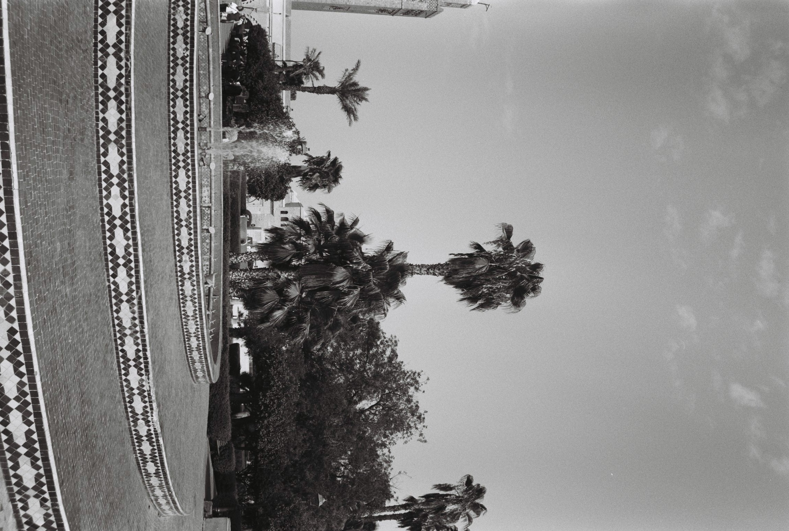
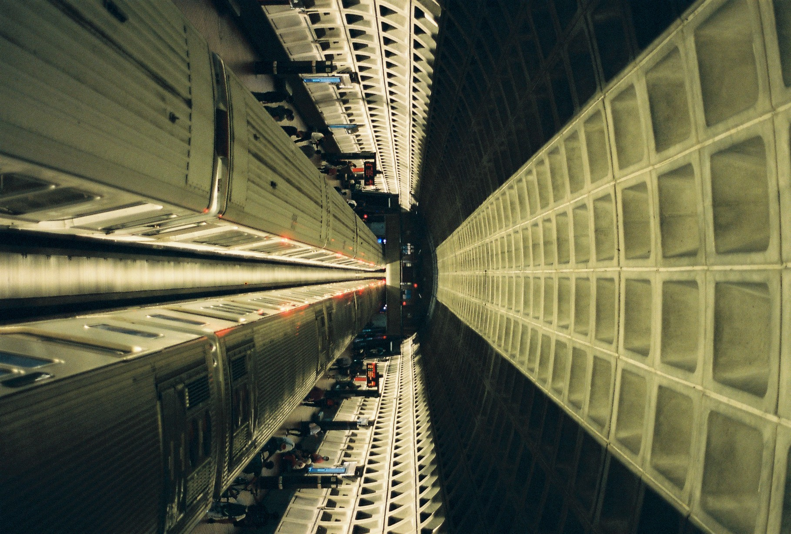
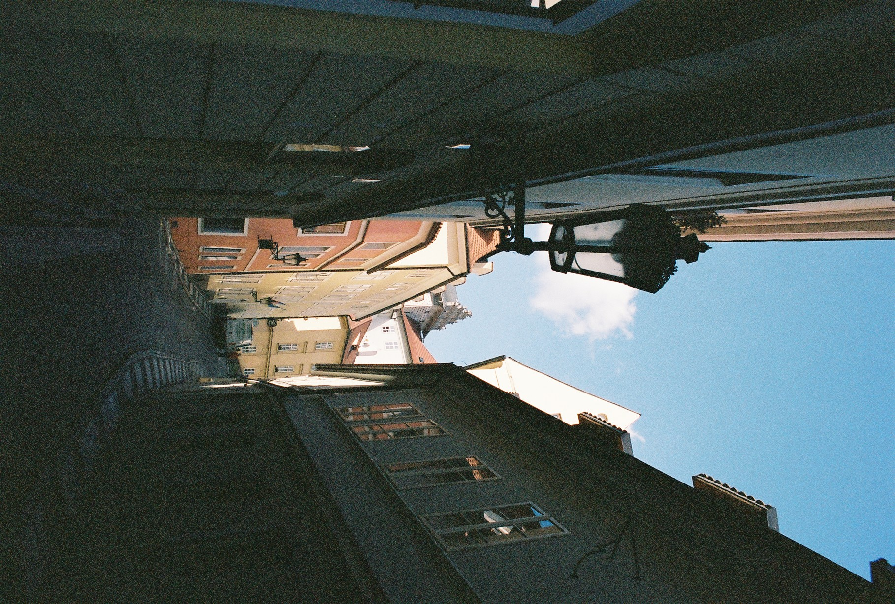
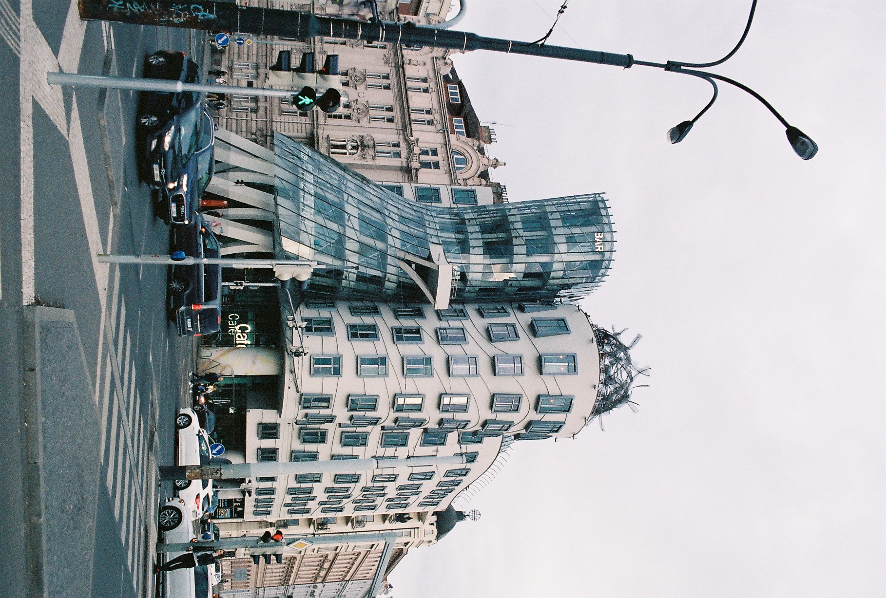

← [Back to all visuals](/visuals/)

Not a curated series yet — just the first batch I wanted **on the site** so the visuals section is not empty. Order is how I remember taking them.

---

**Technical note:** if any frame still looks one rotation off in the file, rotate in your photo app and overwrite the `.jpg` here — no code change needed.
